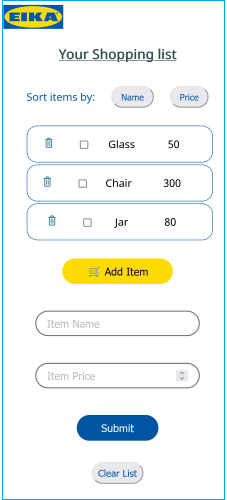
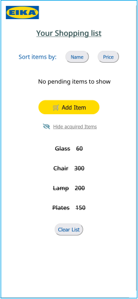

## **EIKA-ShoppinglistApp**

The EIKA shopping list app is a React.js single page web application which allows users to keep track of things they wish to buy at the EIKA store.

This project was bootstrapped with Create React App using the JavaScript template.

EIKA is hosted on:

---

## Pre-requisites

You need to have the following installed before you can install and run this project:

- [Git](https://git-scm.com/book/en/v2/Getting-Started-Installing-Git)
- [Node.js](https://nodejs.org/en/download/)
- An IDE (Integrated development environment), e.g. [Visual Studio Code](https://code.visualstudio.com/download)

---

## Installation

1. Clone this repository: git clone https://github.com/radhad-ux/eika-shoppinglistapp.git

2. Install the dependencies by running npm install in the project directory

3. Run the app in the development mode. In the project directory, run: npm start

4. Open http://localhost:3000 to view it in the browser.

5. To run the project in the production mode, use this command npm run build.

---

## Features

- Add a shopping item with a name and price.
- Sort items by name and price.
- Mark a shopping item as acquired.
- Delete the added item from the shopping list.
- Toggle the display of acquired shopping items.
- Close and reopen the page without losing your list.

---

## Component Hierarchy

[UI Component Tree](https://whimsical.com/eika-shoppinglistapp-CLTiEv7HrSGBBQo3G86mFr)

---

## Design Mockup

[Figma](https://www.figma.com/file/Bz6kGmXNJaqTWHduZm5BAJ/Eika-ShoppingListApp?node-id=0%3A1)

---

## Using the app

If you are using the app for the first time, or if you have no items left to buy, you'll be seeing the welcome screen with an image, paragraph and the add button.

To Add a shopping item

- Click the 'Add item' button.
- Enter a valid name and price.
- Click the Submit button to add the item to the item list.

After adding the desired items in the list

- Sort the items in ascending order with respect to name or price.
- Click the delete button if you don't need the item in the list.
- Click on the checkbox to view the items in the acquired list.

After marking the shopping items as bought

- Toggle between viewing and hiding the list of bought items.
- Click on Clear list button to completely delete the items from the list and you can view the Welcome screen back.

---

## Acknowledgment

- This project is developed during Front end training at [Novare Potential](https://www.novarepotential.com/).

- Thanks to Eduardo Alvarez (Tech Education Team Lead at Novare Potential) for the project briefing and mentoring.

- All icons by FontAwesome (Creative Commons Attribution 4.0 International license).
- Noto Sans font is by from Google Fonts.
- Images from freepik.com.
